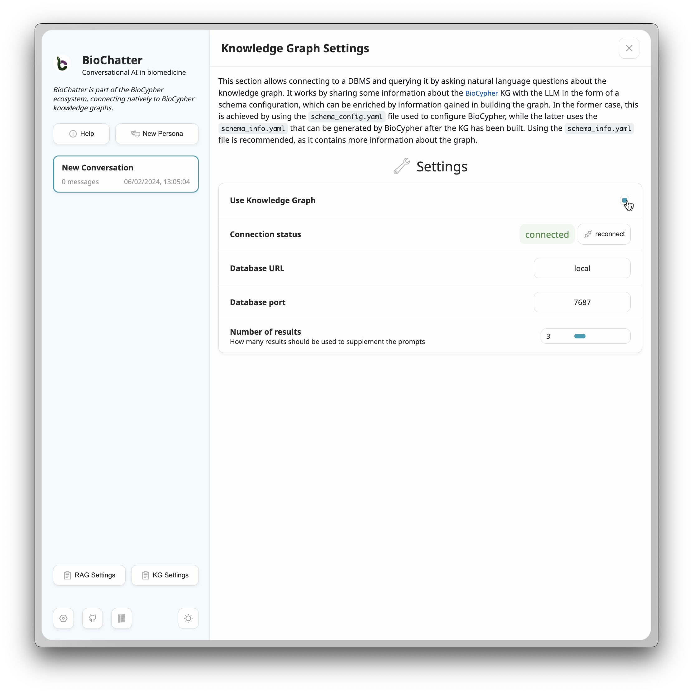
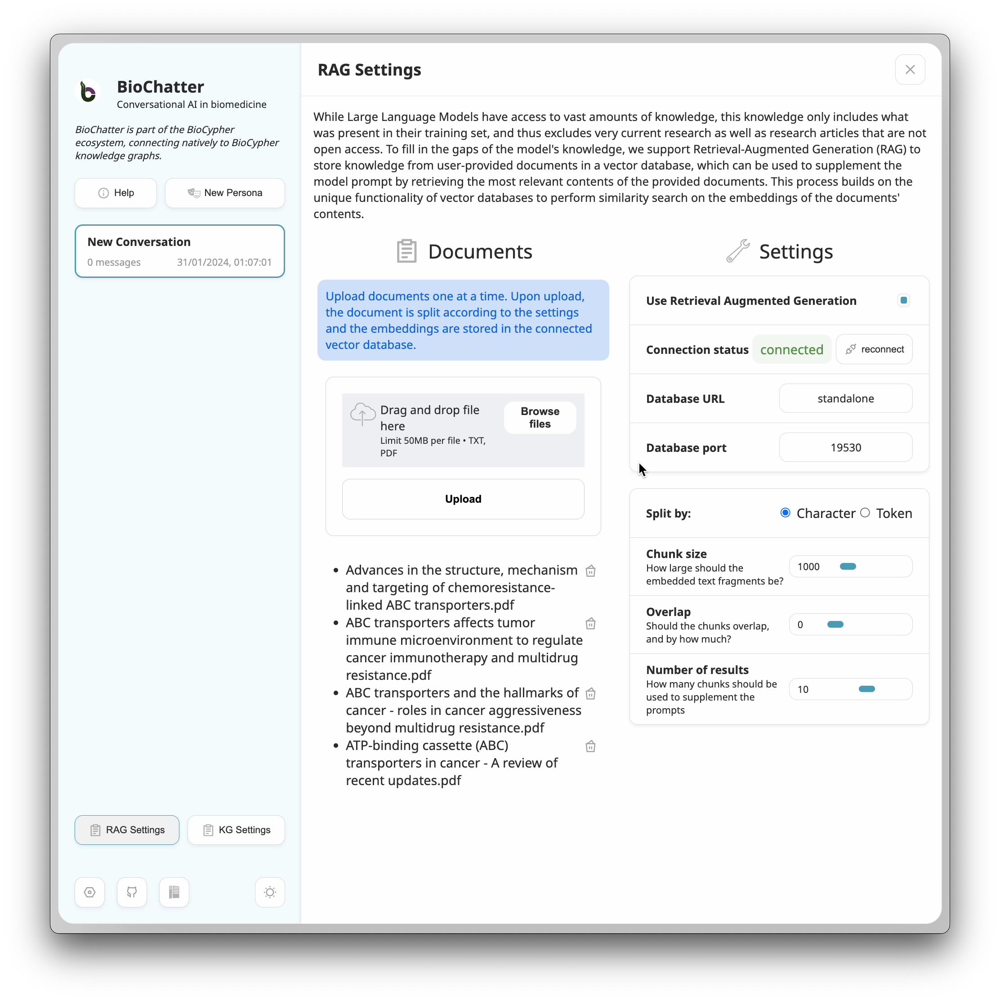

## Supplementary Materials

### Supplementary Note 1: Knowledge Graph Retrieval-Augmented Generation

This vignette demonstrates the KG module of BioChatter as used by the BioChatter
Next application. It is available online (including video and more information)
at [https://biochatter.org/vignette-kg/](https://biochatter.org/vignette-kg/).
We connect to a BioCypher knowledge graph (KG) to retrieve relevant information
for a given question. We then use the retrieved information to generate a
response to the question. The application can connect to any real-world
BioCypher KG by providing the connection details in the `KG Settings` dialog.

###### Background

For the demonstration purposes of this vignette, we include a demo KG based on
an open-source dataset of crime statistics in Manchester, because it allows us
to redistribute the KG due to its small size and public domain licence, and
because it is easily understood. This is the schema of the demo KG:


###### Usage

In BioChatter Next, we first activate the KG functionality by clicking on the
`KG Settings` button in the sidebar. In the settings dialog, we can activate the
KG functionality and select how many results we want to retrieve.



Returning to the conversation and enabling the KG functionality for the current
chat (directly above the send button), we can then ask the model about the KG.
The languange model we use is `gpt-3.5-turbo`. The full conversation is pasted
below, including the queries generated by BioChatter.


In the background, the RagAgent module of BioChatter receives the question and
generates a query to retrieve the desired information. This is then passed back
to the primary model, which includes it in its answer generation.

###### Conclusion

The native integration of BioCypher KGs into the BioChatter framework allows for
a seamless integration of KGs into the conversational AI. This in turn
facilitates knowledge accessibility in a wide range of application domains.

###### Note: the apparent inability of GPT to understand certain directionalities, and how BioChatter compensates for this

Interestingly, while `gpt-3.5-turbo` mostly does a formidable job at translating
natural language questions into Cypher queries, it is remarkably obtuse in
certain instances. For instance, for the relationship `INVESTIGATED_BY`, which
connects a `Crime` to an `Officer`, GPT consistently fails to understand that
the relationship implies that the `Officer` is the one who investigates the
`Crime`. Instead, it consistently interprets the relationship as if the `Crime`
investigates the `Officer`: it consistently proposes the query `MATCH
(o:Officer)-[:INVESTIGATED_BY]->(c:Crime) RETURN c, o` instead of the correct
`MATCH (c:Crime)-[:INVESTIGATED_BY]->(o:Officer) RETURN c, o`. We were not able
to change this behaviour with any contextual prompt instructions.

For this reason, the BioChatter `prompts.py` module uses the knowledge we have
about the directionality of edges in the BioCypher KG to only propose options
for patterns that actually exist in the KG. In the instance of
`INVESTIGATED_BY`, this is the corresponding YAML definition in BioCypher:

```yaml
investigated by:
    is_a: [fact, core]
    represented_as: edge
    label_as_edge: INVESTIGATED_BY
    input_label: INVESTIGATED_BY
    source: crime
    target: officer
```

The presence of the `source` and `target` annotations allows us to provide only
the correct options to the LLM, which in turn allows the LLM to generate the
correct query.

Strikingly, this even applies to `GPT-4` and `ChatGPT`, which we used to
generate the Schema diagram above. The model immediately proposed a correct
Mermaid diagram for most of the entire schema definition YAML file, except for
the relationship between `Crime` and `Officer`, which it reversed. Via the YAML
we provide in the prompt, GPT has access to the correct directionality, but it
still fails to understand it.

```
graph LR;
    Person(:Person) -- KNOWS --> Person
    Person -- FAMILY_REL --> Person
    Person -- LIVES_AT --> Location(:Location)
    Person -- PARTY_TO --> Crime(:Crime)
    Person -- MADE_CALL --> PhoneCall(:PhoneCall)
    Person -- RECEIVED_CALL --> PhoneCall
    Officer(:Officer) -- INVESTIGATED_BY --> Crime
    Crime -- OCCURRED_AT --> Location
    Object(:Object) -- INVOLVED_IN --> Crime

    classDef node fill:#f9f,stroke:#333,stroke-width:2px;
    class Person,Officer,Location,Crime,PhoneCall,Object node;
```

Here is the [full
chat](https://chat.openai.com/share/8e3b8ed6-c8a2-4460-a1ad-fe637e4c3db1) for
reference.

#### Conversation

The boxes below the BioChatter responses in the conversation show the queries
generated by the RagAgent module.

##### Message From You
How many crimes happened in total?

##### Message From BioChatter
According to the provided statement, the total number of crimes is 28,762. This information suggests that there have been 28,762 reported crimes in the given context. However, without additional information or context, it is difficult to determine the specific time period, location, or nature of these crimes. It's important to note that crime statistics can vary depending on the source, methodology, and reporting practices. Therefore, it is always advisable to consult official crime reports or local law enforcement agencies for the most accurate and up-to-date information on crime statistics.

```note
MATCH (c:Crime)
RETURN count(c) AS numberOfCrimes
```

##### Message From You
Where happened most crimes?

##### Message From BioChatter
Based on the provided statement, it appears that the location with the highest number of crimes is a parking area, with a total of 811 reported crimes. However, without additional context or information, it is difficult to determine the consistency or inconsistency of this statement with other available information. It is important to note that crime rates and locations can vary significantly depending on various factors such as the region, city, neighborhood, and specific time period being considered. To provide a more comprehensive analysis, it would be helpful to have access to a broader dataset or additional information about the specific location and its crime statistics.

```note
MATCH (c:Crime)-[:OCCURRED_AT]->(l:Location)
RETURN l.address AS location, COUNT(c) AS crimeCount
ORDER BY crimeCount DESC
```

##### Message From You
Who were the top 3 offenders?

##### Message From BioChatter
Based on the provided information, the top three offenders are:

1. Phillip Williamson: According to the information given, Phillip Williamson has committed 5 crimes.

2. Jessica Kelly: The information states that Jessica Kelly has also committed 5 crimes.

3. Brian Morales: The data indicates that Brian Morales has committed 4 crimes.

These three individuals, Phillip Williamson, Jessica Kelly, and Brian Morales, are the top offenders based on the number of crimes they have committed.

```note
MATCH (p:Person)-[:PARTY_TO]->(c:Crime)
RETURN p.name, p.surname, COUNT(c) AS num_crimes
ORDER BY num_crimes DESC
LIMIT 3
```

### Supplementary Note 2: Retrieval-Augmented Generation

This vignette demonstrates the RAG module of BioChatter as used by the
BioChatter Next application. This basic use case involves an LLM manuscript
reading assistant and a vector database with embedded scientific manuscripts
[@doi:10.1016/j.drup.2022.100905;@doi:10.20892/j.issn.2095-3941.2019.0284;@doi:10.1038/s41568-023-00612-3;@doi:10.1111/jebm.12434].
The manuscripts are recent reviews on the topic of ABC transporters (active
transport proteins that often serve as efflux pumps in many tissues, with a
major function of clearing exogenous substances) in drug resistance phenomena,
which we currently investigate in our [DECIDER](https://deciderproject.eu)
cohort.  Manuscripts such as these can be absent from the knowledge base of LLMs
for various reasons, such as their recency or the fact that they are not open
access. RAG opens up the possibility to retrieve relevant information from these
manuscripts, and to inject it into the LLM's generation process.

#### Usage

In BioChatter Next, we first activate the RAG functionality by clicking on the
`RAG Settings` button in the sidebar. In the settings dialog, we can activate
the functionality and upload an arbitrary number of documents, which is only
limited by the scale of the vector database system. In this case, and for
demonstration purposes, we uploaded the four manuscripts, which leads to the
state shown in the screenshot below.



Note that we chose to split the documents into fragments of 1000 characters
each. We could have split by tokens instead, or changed the fragment length and
overlap. Fragment length, overlap, and splitting by tokens or characters are
decisions that should be made in tandem with the choice of LLM model, and with
the number of fragments that should be retrieved for each query. Most
importantly, the total text length should not exceed the input context length
of the model. Here, we choose to inject 10 fragments per query.

We can now start a new conversation (using the `New Persona` button in the
sidebar), for which we select the `Research manuscript helper (RAG)` persona,
which includes suitable contextual prompts. Upon activating the RAG in the chat
(to signal that we wish to perform RAG for our question), we can enter into a
dialogue with the assistant. We use `gpt-3.5-turbo` in this example, which is a
very affordable model. The procedure is demonstrated in the GIF below.


#### Comparison with ChatGPT

We can ask the same question to ChatGPT 4 (only subscription access).  By
employing web search, ChatGPT 4 is able to find the same study that was the RAG
result we were asked about in our follow-up question (Xu et al. 2015); however,
the answer is not as detailed as the answer provided by the RAG process, and
includes fewer mentions of explicit studies. While it includes sensible
information, there is no way of validating most of the claims made by the model.
You can read the full answer
[here](https://chat.openai.com/share/549f5bf7-b39c-42a4-9483-d07dcbf5b2d9).
Overall, the quality of ChatGPT 4 is comparable to the RAG output, but the user
has less control over the knowledge used, and the answer cannot include
information that is not easily found on the web (for instance due to access
restrictions). Of note, we used `gpt-3.5-turbo` in this example, which is less
recent and much less expensive than GPT-4.

Asking the naive ChatGPT 3.5 (free access), the same question yields a very
different answer. The free version of ChatGPT cannot search the internet, and
does not provide any citations for the general answer it provides. You can read
the full answer
[here](https://chat.openai.com/share/810075aa-69fe-4c06-859d-229e250f4c41). For
convenience, all three conversations are copied below. 

#### Conclusion

In conclusion, the RAG procedure we implement is able to dramatically improve
the quality of GPT-3 answers, making them comparable to GPT-4 with web search,
and even surpassing it in some aspects. We invite you to try it out yourself, as
we provide an instance of BioChatter Next, including GPT access and a vector
database instance, free of charge at
[https://next.biochatter.org](https://next.biochatter.org).

#### Conversations

##### BioChatter RAG

###### Contextual Prompt
You are an assistant to a biomedical researcher.

###### Contextual Prompt
You have access to text fragments from one or multiple scientific manuscripts, which were retrieved by their semantic similarity to the user's question.

###### Contextual Prompt
Your task is to help the user understand the manuscripts and their relevance to their questions. Be concise in your explanations, provide quotes from the manuscripts where appropriate, and be open about limitations in cases where the text does not contain pertinent information.

###### Message From You
What is known about the CFTR protein in resistance to ovarian cancer?

###### Message From BioChatter
Based on the provided information, there are several studies that suggest a potential role of the CFTR (Cystic Fibrosis Transmembrane Conductance Regulator) protein in resistance to ovarian cancer. Here are some key findings from the referenced manuscripts:

1. Gene expression profiling of ovarian tumors before and after chemotherapy revealed molecular signatures of chemoresistant tumors (M, et al., 2006). This study did not specifically mention CFTR, but it provides insights into the molecular changes associated with chemoresistance.

2. ABCF2 expression, which is related to CFTR, was investigated in clear cell adenocarcinoma of the ovary. The study found a relationship between ABCF2 expression and response to chemotherapy or prognosis (Tsuda H, et al., 2010).

3. Alterations in gene copy numbers, including CFTR, were identified as a mechanism for acquired drug resistance in cancer (Yasui K, et al., 2004).

4. ABCF2, an Nrf2 target gene related to CFTR, was found to contribute to cisplatin resistance in ovarian cancer cells (Bao L, et al., 2017).

5. CFTR was not specifically mentioned in the context of ovarian cancer, but a study on hepatocellular carcinoma found that silencing circ-TCF4.85 inhibited cancer progression through microRNA-486-5p-targeted inhibition of ABCF2 (Gao J, et al., 2020).

6. Constitutive activation of nuclear factor κB (NF-κB) was associated with CFTR expression and promoted cancer progression and poor prognosis in cervical cancer (Wu Z, et al., 2013).

7. High levels of CFTR expression were associated with tumor aggression in ovarian cancer, and knockdown of CFTR suppressed ovarian cancer cell proliferation (Xu J, et al., 2015).

It is important to note that while these studies suggest a potential association between CFTR and resistance to ovarian cancer, the exact mechanisms and clinical implications are still being investigated. Further research is needed to fully understand the role of CFTR in ovarian cancer resistance.

###### Message From You
Tell me more about the studies of aggression and knockdown of CFTR in vivo.

###### Message From BioChatter
Based on the provided information, there are two relevant studies regarding the aggression and knockdown of CFTR in ovarian cancer:

1. The study by Wu et al. (2013) investigated the constitutive activation of nuclear factor κB (NF-κB) and its contribution to CFTR expression, cancer progression, and poor prognosis in cervical cancer. Although this study is not specific to ovarian cancer, it provides insights into the role of CFTR and NF-κB in promoting cancer progression.

2. The study by Xu et al. (2015) focused specifically on ovarian cancer and found that high levels of CFTR expression were associated with tumor aggression. They also demonstrated that knockdown of CFTR suppressed the proliferation of ovarian cancer cells in vitro and in vivo. This study suggests that CFTR may play a role in promoting ovarian cancer growth.

These studies provide evidence for the involvement of CFTR in cancer aggression and suggest that targeting CFTR could be a potential therapeutic strategy. However, it is important to note that these studies focus on different types of cancer (cervical and ovarian), and the specific mechanisms underlying CFTR's role in ovarian cancer aggression and its knockdown effects are not fully elucidated.

It is worth mentioning that the other references provided in the text fragments are not directly related to the aggression and knockdown of CFTR in ovarian cancer. They discuss topics such as the structure and function of ABC transporters, drug resistance, and inflammation in different contexts.

##### ChatGPT 4

###### Anonymous
What is known about the CFTR protein in resistance to ovarian cancer?

###### ChatGPT
The CFTR protein, known as the cystic fibrosis transmembrane conductance regulator, plays a significant role in ovarian cancer. Research has shown that CFTR is expressed more in ovarian cancer tissues compared to benign ovarian tumors and normal ovaries. This overexpression of CFTR is associated with more advanced stages of ovarian cancer, poor histopathological grade, and higher serum Ca-125 levels, which are all markers of more aggressive disease. Interestingly, the serous type of ovarian cancer shows stronger CFTR staining compared to other types.

Moreover, the role of CFTR extends beyond its traditional function as an ion channel. It interacts with various intracellular signaling pathways that are crucial in cancer progression. For example, in ovarian cancer, CFTR overexpression is linked to interactions with the c-Src signaling pathway, which is involved in cellular growth.

The implications of CFTR expression in ovarian cancer are significant. In studies where CFTR was downregulated, there was a decrease in cell invasion, migration, proliferation, adhesion, and colony formation in vitro. In vivo experiments also showed that the tumorigenic abilities of ovarian cancer cells were significantly repressed when CFTR expression was reduced.

These findings highlight the complex role of CFTR in ovarian cancer and suggest that it could be a potential target for therapeutic intervention. However, it is important to note that the role of CFTR in cancer is multifaceted and varies among different types of cancers. Therefore, a detailed understanding of its function in specific cancer types, like ovarian cancer, is crucial for developing targeted treatments​​​​ (https://pubmed.ncbi.nlm.nih.gov/25738998/, https://jmhg.springeropen.com/articles/10.1186/s43042-022-00308-7).

##### ChatGPT 3.5

###### Anonymous
What is known about the CFTR protein in resistance to ovarian cancer?

###### ChatGPT
As of my last knowledge update in January 2022, there is limited direct information about the CFTR (Cystic Fibrosis Transmembrane Conductance Regulator) protein's role in resistance to ovarian cancer. CFTR is primarily associated with cystic fibrosis, a genetic disorder that affects the lungs and other organs. However, some research suggests potential links between CFTR and cancer, including ovarian cancer, although the mechanisms are not fully understood.

Here are some key points to consider:

CFTR Expression: Studies have shown that CFTR is expressed in various tissues, including the female reproductive system. Abnormal CFTR expression or function could potentially impact the development or progression of ovarian cancer. Research is ongoing to understand the role of CFTR in cancer biology.
CFTR Mutations: Certain mutations in the CFTR gene have been associated with an increased risk of cancer, although the evidence for ovarian cancer specifically is limited. Mutations in CFTR are more commonly known for their role in cystic fibrosis. Individuals with cystic fibrosis have an increased risk of various cancers, including gastrointestinal cancers, but the link to ovarian cancer is not well-established.
Ion Transport and Cancer: CFTR is involved in ion transport across cell membranes, and this function could potentially influence cellular processes relevant to cancer. Changes in ion transport can affect cell proliferation, apoptosis, and other cellular functions that are important in cancer development and progression.
Potential Therapeutic Target: Some research suggests that modulating CFTR activity or expression could be a potential target for cancer therapy, including ovarian cancer. However, more research is needed to determine the feasibility and effectiveness of such approaches.
It's important to note that the understanding of the role of CFTR in cancer, including ovarian cancer, is an evolving field, and new research findings may have emerged since my last update in January 2022. To get the most up-to-date information on this topic, I recommend consulting recent scientific literature and speaking with medical experts or researchers actively working in the field of ovarian cancer and CFTR biology.
